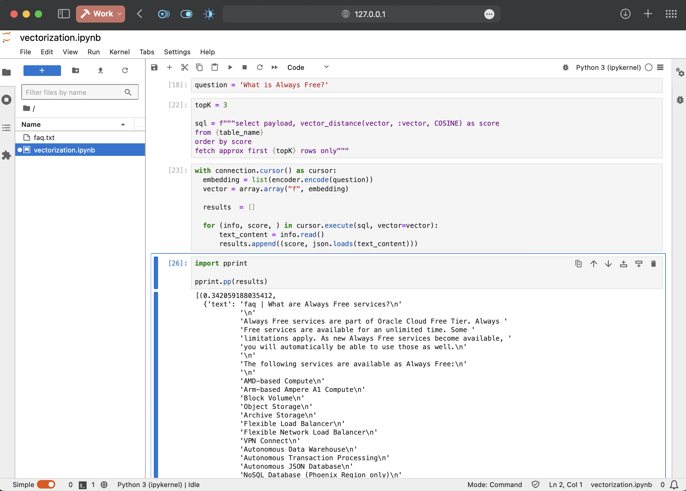
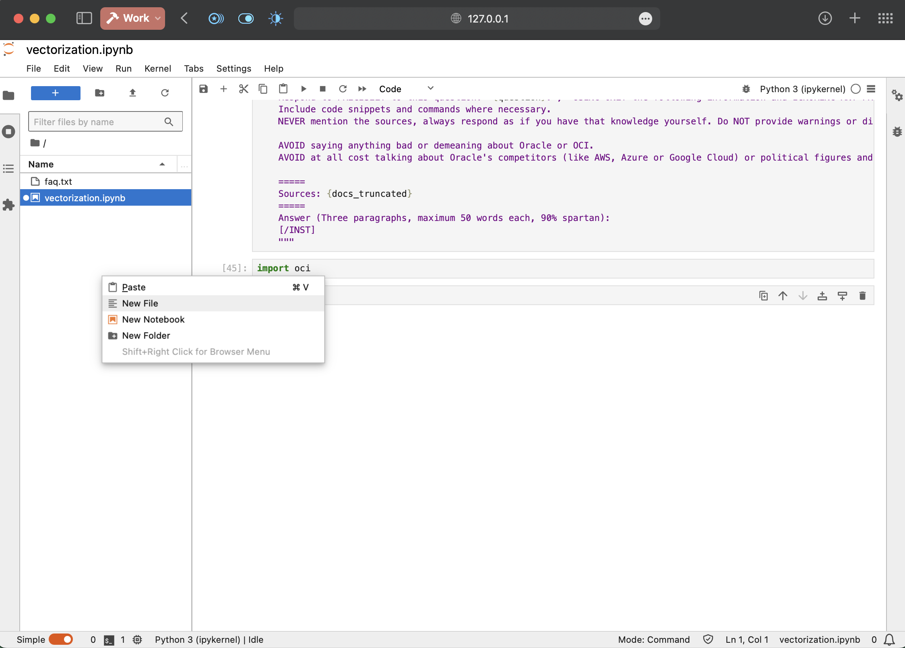
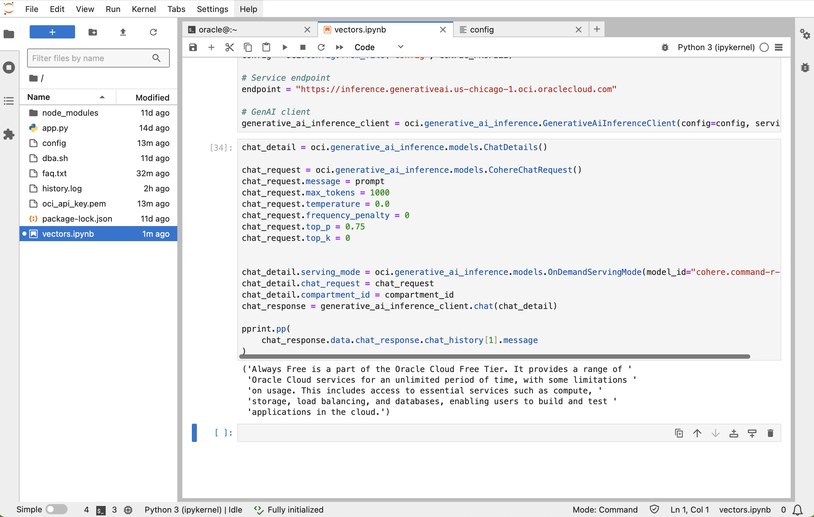

# Vector retrieval and Large Language Model generation

## Introduction

This lab guides you through the steps to integrate the vector database (Oracle Database 23ai in our case) and retrieve a list of text chunks that are close to the "question" in vector space. Then, we will use the most relevant text chunks to create an LLM prompt and ask the Oracle Generative AI Service to create a nicely worded response for us.

This is a classical Retrieval-Augmented Generation (RAG) approach. The Retrieval-Augmented Generation architecture combines retrieval-based and generation-based methods to enhance natural language processing tasks. It consists of a retriever, which searches a knowledge base for relevant documents, and a generator, which uses these documents to produce informed responses. This dual approach improves accuracy and detail compared to models relying solely on pre-trained knowledge.

The retriever employs finds the most pertinent documents by embedding both queries and documents into the same vector space. This ensures that the top-N relevant documents are selected to provide additional context for the generator. By doing so, the retriever enhances the quality of the generated text, particularly for queries needing specific or up-to-date information.

The generator, based on models like LLaMA 2, integrates the retrieved documents into its response generation. It may concatenate the query with the retrieved texts or use attention mechanisms to focus on relevant parts, producing coherent and contextually rich responses. This combination allows RAG to handle diverse tasks, making it a versatile tool in natural language processing.

Estimated Time: 40 minutes

### Objectives
In this lab, you will:

* Write Python code to retrieve records from a vector database based on vector distance from a "question".
* Create a large language model prompt using the question, the top chunks from the knowledge base, and custom instructions.
* Use the prompt to call the Oracle Generative AI Service and get a response from an LLM model.

### Prerequisites

* Basic knowledge of Oracle Cloud Infrastructure (OCI) concepts and the console
* Working knowledge of Python and Jupyter Lab
* A working OCI tenancy for the GenerativeAI service calls
* Completion of all previous labs

## Task 1: Vectorize the "question"
In this step, we will take a text, supposedly the question the user is asking to the bot, and transform it into a vector. We will then feed this vector to the database, where it will be used to retrieve similar vectors and associated metadata, which are stored in the database. 

Please ensure that you have opened the Jupyter Notebook from the previous lab.

### Step 1: Define the SQL script used to retrieve the chunks

```python
<copy>
topK = 3

sql = f"""select payload, vector_distance(vector, :vector, COSINE) as score
from {table_name}
order by score
fetch approx first {topK} rows only"""
</copy>
```
In the given SQL query, `topK` represents the number of top results to retrieve. The query selects the payload column along with the cosine distance between the vector column in the specified table (`table_name`) and a provided vector parameter `:vector`, aliasing the distance calculation as `score`. 

By ordering the results by the calculated `score` and using `fetch approx first {topK} rows onl`y, the query efficiently retrieves only the top `topK` results based on their cosine similarity to the provided vector. 

### Step 2: Transforming the question into a vector
First, we define the question in a new cell.

```python
<copy>
question = 'What is Always Free?'
</copy>
```

Next, we write the retrieval code. We employ the same encoder as in previous text chunks, generating a vector representation of the question.

```python
<copy>
with connection.cursor() as cursor:
  embedding = list(encoder.encode(question))
  vector = array.array("f", embedding)
</copy>  
```
Do not run it yet; we still need to write the most important part.

### Step 3: Executing the query
Let's add the following code:

```python
<copy>
with connection.cursor() as cursor:
  embedding = list(encoder.encode(question))
  vector = array.array("f", embedding)

  results  = []

  for (info, score, ) in cursor.execute(sql, vector=vector):
      text_content = info.read()
      results.append((score, json.loads(text_content)))
</copy>
```

The SQL query is executed with the provided vector parameter, fetching relevant information from the database. For each result, the code retrieves the text content, stored in JSON format, and appends it to a list along with the calculated similarity score. This process iterates through all fetched results, accumulating them in the `results` list.

If we print the results, we obtain something like the following. As requested, we have the "score" of each hit, which is essentially the distance in vector space between the question and the text chunk, as well as the metadata JSON embedded in each chunk.
```python
import pprint
pprint.pp(results)
```

```
[(0.342059188035412,
  {'text': 'faq | What are Always Free services?\n'
           '\n'
           'Always Free services are part of Oracle Cloud Free Tier. Always '
           'Free services are available for an unlimited time. Some '
           'limitations apply. As new Always Free services become available, '
           'you will automatically be able to use those as well.\n'
           '\n'
           'The following services are available as Always Free:\n'
           'Email Delivery',
   'path': 'faq'}),
 (0.4832669049335745,
  {'text': 'faq | Are Always Free services available for paid accounts?\n'
           '\n'
           'Yes, for paid accounts using universal credit pricing.',
   'path': 'faq'}),
 (0.4878004407118778,
  {'text': 'faq | Could you elaborate on the concept of Always Free resources '
           'in Oracle Cloud Infrastructure, and how can users leverage them '
           'for various use cases while staying within the specified '
           'limitations?\n'
           '\n'
           'Always Free resources in Oracle Cloud Infrastructure are services '
           'and resources that can be used without incurring charges, subject '
           'to certain usage limitations. Users can leverage these resources '
           'for development, testing, small-scale applications, and learning '
           'purposes, all while adhering to the restrictions outlined in the '
           'terms and conditions.',
   'path': 'faq'})]
```



## Task 2: Create the LLM prompt
In a Retrieval-Augmented Generation (RAG) application, the prompt given to a Large Language Model (LLM) is crucial for ensuring that the model generates accurate and contextually relevant responses. It effectively integrates retrieved information with the query, clarifies user intent, and frames the context in which the LLM operates. A well-crafted prompt enhances the relevance and accuracy of the generated text by providing clear instructions and integrating various aspects of the retrieved data. This is essential for optimizing performance, handling complex queries, and delivering precise and user-satisfactory outputs in real-time applications.

1. Before sending anything to the LLM, we must ensure that our prompt does not exceed the maximum context length of the model. We are planning to use LLaMA 2, so the context is limited to 4,096 tokens. Note that the context is used for both the input tokens (the prompt) and the response.

    ```python
    <copy>
    <if type="freetier">from transformers import LlamaTokenizerFast
    import sys

    tokenizer = LlamaTokenizerFast.from_pretrained("hf-internal-testing/llama-tokenizer")</if>
    <if type="livelabs">from transformers import AutoTokenizer
    import sys

    tokenizer = AutoTokenizer.from_pretrained("./transformers/all-MiniLM-L12-v2", local_files_only=True)</if>
    <if type="ocw24">from transformers import AutoTokenizer
    import sys

    tokenizer = AutoTokenizer.from_pretrained("./transformers/all-MiniLM-L12-v2", local_files_only=True)</if>
    tokenizer.model_max_length = sys.maxsize

    def truncate_string(string, max_tokens):
        # Tokenize the text and count the tokens
        tokens = tokenizer.encode(string, add_special_tokens=True) 
        # Truncate the tokens to a maximum length
        truncated_tokens = tokens[:max_tokens]
        # transform the tokens back to text
        truncated_text = tokenizer.decode(truncated_tokens)
        return truncated_text
    </copy>
    ```

    This code leverages the *Hugging Face Transformers* library to tokenize text using the *LlamaTokenizerFast* model. The tokenizer is initialized from the pre-trained `hf-internal-testing/llama-tokenizer` model, and its `model_max_length` attribute is set to `sys.maxsize` to handle extremely large inputs without length constraints.

    The `truncate_string` function takes a string and a maximum token count as inputs. It tokenizes the input string, truncates the tokenized sequence to the specified maximum length, and then decodes the truncated tokens back into a string. This function effectively shortens the text to a specified token limit while preserving its readable format, useful for tasks requiring length constraints on input text.

    We will truncate our chunks to 1000 tokens, to leave plenty of space for the rest of the prompt and the answer.
    ```python
    <copy>
    # transform docs into a string array using the "paylod" key
    docs_as_one_string = "\n=========\n".join([doc["text"] for doc in results])
    docs_truncated = truncate_string(docs_as_one_string, 1000)
    </copy>
    ```

2. In our case, the prompt will include the retrieved top chunks, the question posed by the user, and the custom instructions.

    ```python
    <copy>
      prompt = f"""\
        <s>[INST] <<SYS>>
        You are a helpful assistant named Oracle chatbot. 
        USE ONLY the sources below and ABSOLUTELY IGNORE any previous knowledge.
        Use Markdown if appropriate.
        Assume the customer is highly technical.
        <</SYS>> [/INST]

        [INST]
        Respond to PRECISELY to this question: "{question}.",  USING ONLY the following information and IGNORING ANY PREVIOUS KNOWLEDGE.
        Include code snippets and commands where necessary.
        NEVER mention the sources, always respond as if you have that knowledge yourself. Do NOT provide warnings or disclaimers.
        =====
        Sources: {docs_truncated}
        =====
        Answer (Three paragraphs, maximum 50 words each, 90% spartan):
        [/INST]
        """
    </copy>
    ```

### Step 1: Prepare the environment
## Task 3: Call the Generative AI Service LLM

<if type="ocw24">
0. **If you're running this lab at CloudWorld**

In this case, the credentials needed to access the OCI GenAI Service are provided for you. Click on the link below and download the zip file.

[Get Your OCI GenAI key](https://objectstorage.us-ashburn-1.oraclecloud.com/p/75QkYvgn8zNo7vSaI8M4k5GGvs62bRQzeHPQFCxoQQZD1nwD5sl8oDyWjkBvAScE/n/c4u04/b/OCW2024/o/api/tut3008.zip)

Unzip the downloaded file and copy the text file and non-public pem file to your JupyterLab window.
Rename the text file to `config` (no extension).

Double-click to open it in Jupyter. It will look like this:
```
[DEFAULT]
user=ocid1.user.oc1..zzzzzzzzzzzzz
fingerprint=80:2a:84:00:29:2d:ec:04:8b:ee:xxxx
tenancy=ocid1.tenancy.oc1..yyyyyyyyyyyy
region=us-chicago-1
key_file=<path to your private keyfile> # TODO

Compartment ocid = ocid1.compartment.oc1..xxxxxxxx
```
Make note of your compartment ocid and delete that line (the last one in the file). You will need it in point 2 below.

Enter the path and name of your private key at the end of the `key_file` line.


> Note: The details in paragraph 1 below are provided for your information only. It is safe to skip to point 2.
</if>

1. In Jupyter, create a new file called `config`.

    

    Right-click it and select `Open`, then enter the following in the editor:

    ```
    <copy>
    [DEFAULT]
    user=<your user's ocid>
    key_file=<path to your .pem key>
    fingerprint=<fingerprint of the key>
    tenancy=<your tenancy's ocid>
    region=us-chicago-1
    </copy>
    ```

    The **user's OCID** can be retrieved like this:
    -	Sign in to the Oracle Cloud Console.
    -	In the top-right corner, click on your user profile icon, then click on “User Settings”.
    -	In the User Settings page, you will find your User OCID.

    The **key file** is generated using the instructions [from this doc](https://docs.oracle.com/en-us/iaas/Content/API/Concepts/apisigningkey.htm#apisigningkey_topic_How_to_Generate_an_API_Signing_Key_Console).

    The **tenancy's OCID**:
    -	Open the Navigation Menu (the hamburger menu icon).
    -	Under Identity, click on Tenancy.
    -	The Tenancy OCID will be displayed on the Tenancy details page.

    While you have the Console open, fetch also the **compartment OCID** (you will need it in the next step):
    -	Navigate to Identity: Open the main menu and select Identity & Security -> Compartments.
    -	List of Compartments: You will see a list of compartments. Click on the compartment you need the OCID for.
    -	Compartment Details: The details page of the compartment will display its OCID.

    Instructions on how to obtain the OCI API key and fingerprint values can be found [here](https://oracle-livelabs.github.io/apex/ai-vision-lab/workshops/tenancy/index.html?lab=1-configure-oci) and [here](https://docs.oracle.com/en-us/iaas/Content/API/Concepts/apisigningkey.htm#apisigningkey_topic_How_to_Generate_an_API_Signing_Key_Console).

2. Initializing the OCI client.

    ```python
    <copy>
    import oci

    compartment_id = "<compartment ocid>"
    CONFIG_PROFILE = "DEFAULT"
    config = oci.config.from_file('config', CONFIG_PROFILE)

    # Service endpoint
    endpoint = "https://inference.generativeai.us-chicago-1.oci.oraclecloud.com"

    # GenAI client
    generative_ai_inference_client = oci.generative_ai_inference.GenerativeAiInferenceClient(config=config, service_endpoint=endpoint, retry_strategy=oci.retry.NoneRetryStrategy(), timeout=(10,240))
    </copy>
    ```

### Step 2: Make the call
This code leverages *Oracle Cloud Infrastructure (OCI)* to generate text using a language model, specifically the “*cohere.command-r-plus*” model. The process starts by creating an inference request where various parameters are defined. These parameters include the input prompt, the maximum number of tokens to generate, and settings for controlling the randomness and creativity of the output, such as `temperature` and `top_p` values. The `is_stream` attribute is set to `False`, indicating that the SDK currently does not support streaming responses.

Next, the code sets up the details required for the text generation request. This involves specifying the serving mode and model ID, which identifies the language model to use, and the compartment ID where the request will be processed. The inference request, with all its configured parameters, is then attached to these details. This setup ensures that the OCI service knows exactly what model to use and how to handle the request.

Finally, the configured text generation request is sent to *OCI’s Generative AI* inference client. The client processes the request and returns a response containing the generated text. The response is extracted and cleaned of any leading or trailing whitespace before being printed in a readable format.

```python
<copy>
chat_detail = oci.generative_ai_inference.models.ChatDetails()

chat_request = oci.generative_ai_inference.models.CohereChatRequest()
chat_request.message = prompt
chat_request.max_tokens = 1000
chat_request.temperature = 0.0
chat_request.frequency_penalty = 0
chat_request.top_p = 0.75
chat_request.top_k = 0

chat_detail.serving_mode = oci.generative_ai_inference.models.OnDemandServingMode(model_id="cohere.command-r-plus")
chat_detail.chat_request = chat_request
chat_detail.compartment_id = compartment_id
chat_response = generative_ai_inference_client.chat(chat_detail)

pprint.pp(
    chat_response.data.chat_response.chat_history[1].message
)
</copy>
```

If everything goes well, we shall see a response like this one after a few seconds.


You may now **proceed to the next lab**

## Learn More
* [Oracle Generative AI Service](https://www.oracle.com/artificial-intelligence/generative-ai/generative-ai-service/)
* [Oracle Database Free](https://www.oracle.com/database/free/)
* [Get Started with Oracle Database 23ai](https://www.oracle.com/ro/database/free/get-started/)

## Acknowledgements
* **Author** - Bogdan Farca, Customer Strategy Programs Leader, Digital Customer Experience (DCX), EMEA
* **Contributors** 
   - Liana Lixandru, Principal Digital Adoption Manager, Digital Customer Experience (DCX), EMEA
   - Kevin Lazarz, Senior Manager, Product Management, Database
* **Reviewers**
  - Rahul Gupta, Senior Cloud Engineer, Analytics
  - Kashif Manzoor, Master Principal Account Cloud Engineer, EMEA AI CoE
* **Last Updated By/Date** -  Bogdan Farca, Jan 2025
