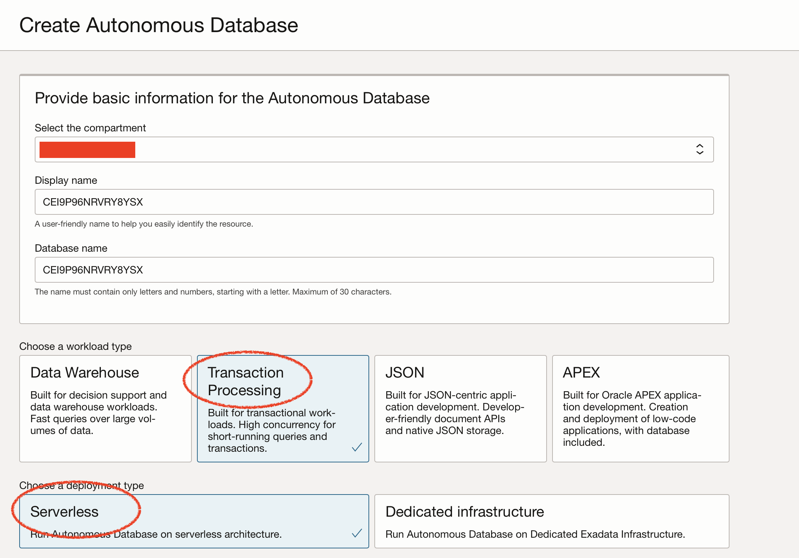
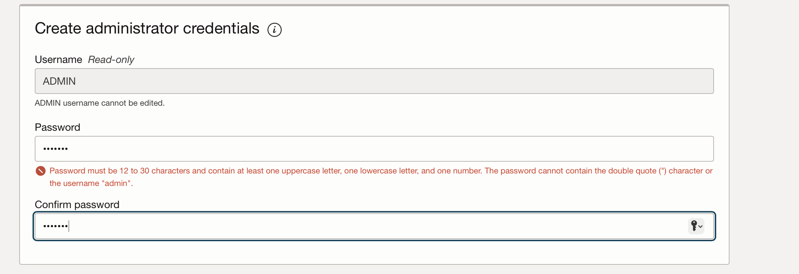
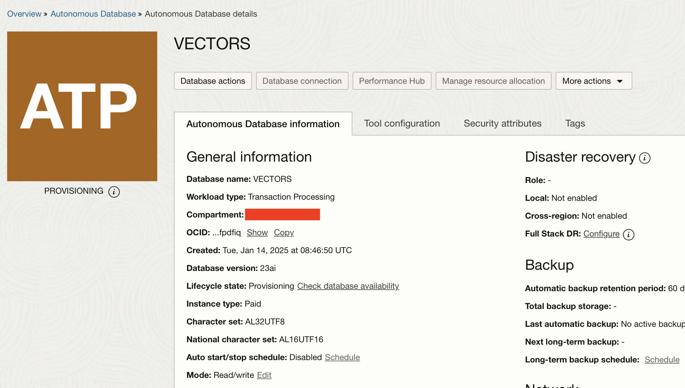
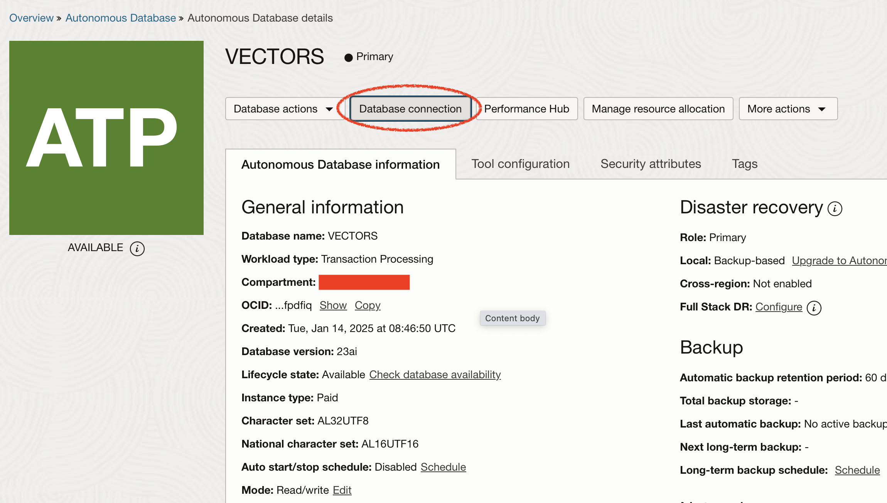
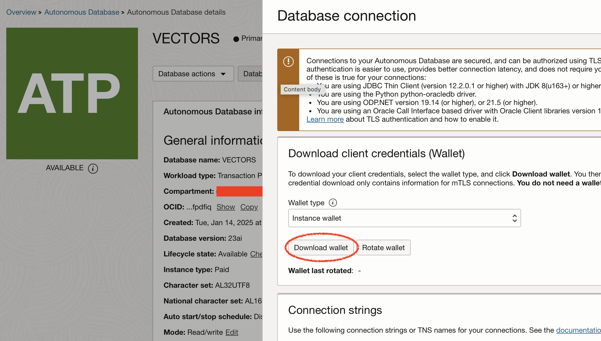

# Setup the vector database (Oracle Database 23ai)

## Introduction

This lab guide you through setting up Oracle Database Free (23c) in a container and setting it up for vector operations.

Estimated Time: 15 minutes

### Objectives

* Create an Oracle Cloud Infrastructure (OCI) Compute instance needed to run the workshop.
* Install and configure the vector database.

### Prerequisites

* Basic knowledge of Oracle Cloud Infrastructure (OCI) concepts and console
* Basic Linux knowledge

> Note: Any kind of Linux-based system is okay, but you will need to modify the following instructions to suit your specific setup.

## Task 1: Install and configure the database (Oracle Database 23ai)

1. Open your Oracle Cloud Infrastructure Cloud Console and make sure you are in the "US Midwest (Chicago)" or "Frankfurt" region, which is necessary to access the OCI Generative AI services endpoint.

2. Click on the hamburger menu and select `Autonomous Transaction Processing" from the "Oracle Database" section.

 

3. Click on "Create Autonomous Database" to start the instance creation process. The Create Autonomous Database page is displayed. Select your desired region and compartment. If you are using a sandbox environment (green button) and get a Forbidden message, that indicates you are in the wrong compartment. In the Compartment drop-down list, select your assigned compartment that is listed on the Reservation Information page.

 

4. In the Provide basic information for the Autonomous Database section, specify the following:

- **Compartment**: Select the compartment you just created.
- **Display name**: Enter a memorable name for the database for display purposes. For this lab, use MyQuickStart.
- **Database Name**: Use letters and numbers only, starting with a letter. Maximum length is 14 characters. (Underscores not supported.) For this lab, use `VECTORS`.

   In the Choose a workload type section, choose a workload type. Select the workload type for your database from the following choices:

- **Data Warehouse**: Designed to support all standard SQL and business intelligence (BI) tools, and provides all of the performance of the market-leading Oracle Database in an environment that is tuned and optimized for data warehouse workloads
- **Transaction Processing**: Provides all of the performance of the market-leading Oracle Database in an environment that is tuned and optimized to meet the demands of a variety of applications, including: mission-critical transaction processing, mixed transactions and analytics, IoT, and JSON document store
- **JSON Database**: It is Oracle Autonomous Transaction Processing, but designed for developing NoSQL-style applications that use JavaScript Object Notation (JSON) documents. You can store up to 20 GB of data other than JSON document collections. There is no storage limit for JSON collections.
- **APEX**: It is a low cost, Oracle Cloud service offering convenient access to the Oracle APEX platform for rapidly building and deploying low-code applications

   For this workshop select "Transaction Processing" and "Serverless".

   

5. Enter a password for your admin account (and write it down)

6. In the Choose network access section, select one of the following options:
- **For this lab**, accept the default, **Secure access from everywhere**.
- If you want to allow traffic only from the IP addresses and VCNs you specify - where access to the database from all public IPs or VCNs is blocked, select **Secure access from allowed IPs and VCNs only** in the Choose network access area.
- If you want to restrict access to a private endpoint within an OCI VCN, select **Private endpoint access only** in the Choose network access area.
- If the Require mutual TLS (mTLS) authentication option is selected, mTLS will be required to authenticate connections to your Autonomous Database. TLS connections allow you to connect to your Autonomous Database without a wallet, if you use a JDBC thin driver with JDK8 or above. See the documentation for network options for options to allow TLS, or to require only mutual TLS (mTLS) authentication.

   

7. Click on "Create Autonomous Database".

   

   The database is being provisioned now. Let's wait until it's running.

   

8. Once the database is AVAILABLE, click on the "Database connection" button.

   

   Now click on "Download wallet" and provide apassword when asked.

   

You may now **proceed to the next lab**

## Learn More
* [Oracle Generative AI Service](https://www.oracle.com/artificial-intelligence/generative-ai/generative-ai-service/)
* [Oracle Database Free](https://www.oracle.com/database/free/)
* [Get Started with Oracle Database 23ai](https://www.oracle.com/ro/database/free/get-started/)

## Acknowledgements
* **Author** - Bogdan Farca, Customer Strategy Programs Leader, Digital Customer Experience (DCX), EMEA
* **Contributors** 
   - Liana Lixandru, Senior Digital Adoption Manager, Digital Customer Experience (DCX), EMEA
   - Kevin Lazarz, Senior Manager, Product Management, Database
* **Last Updated By/Date** -  Bogdan Farca, May 2024